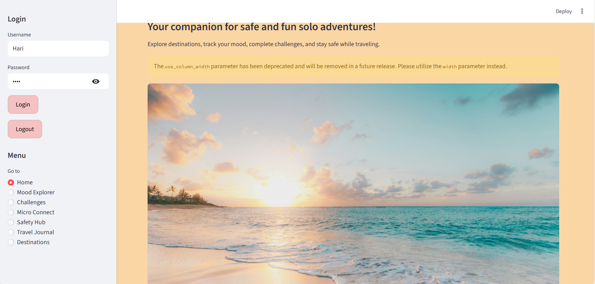
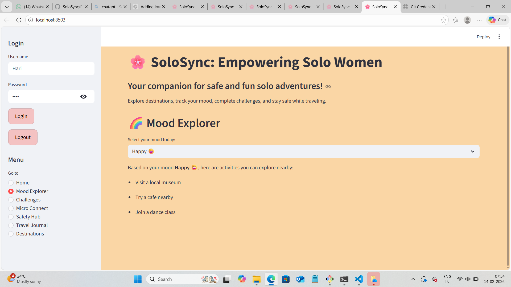
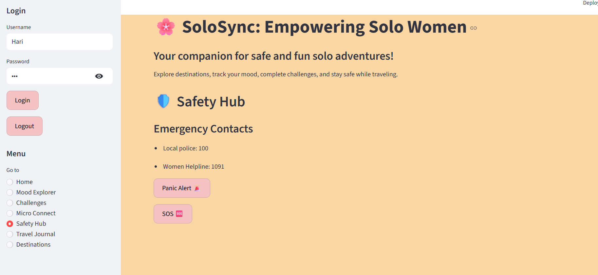

<p align="center">
  
</p>

# [SoloSync] 🎯

## Basic Details

### Team Name: [Carpe Diem]

### Team Members
- Member 1: [Harinandana S] - [NSS College of Engineering Palakkad]
- Member 2: [Diya Mirsha P] - [NSS College of Engineering Palakkad]

### Hosted Project Link
[http://localhost:8501/]

### Project Description
[SoloSync is a women-focused web application designed to make solo travel safe, fun, and empowering. It acts as a personalized digital companion that combines emotional support, safety tools, and community connections into one platform]

### The Problem statement
[Women traveling alone often face safety concerns, isolation, and difficulty finding activities that match their mood. Current travel solutions are fragmented, leaving solo travelers without a central platform for support, engagement, and connection.]

### The Solution
[SoloSync provides a centralized platform for women solo travelers by combining mood-based activity suggestions, fun challenges, micro-connections with other travelers, safety tools like SOS/panic alerts, and a travel journal. This ensures travelers feel safe, engaged, and connected throughout their journey.]

---

## Technical Details

### Technologies/Components Used

**For Software:**
- Languages used: [python, streamlit]
- Frameworks used: [Streamlit (for web app interface)]
- Libraries used: [random, pandas (optional, if used for data handling), streamlit components]
- Tools used: [VS Code, Git, GitHub, web browser]

**For Hardware:**
- Main components: [List main components]
- Specifications: [Technical specifications]
- Tools required: [List tools needed]

---

## Features

List the key features of your project:
- Feature 1: [Mood Explorer: Suggests activities based on your current mood to make solo travel more fun and personalized.]
- Feature 2: [Challenges: Complete fun solo challenges, earn points, and unlock badges to stay motivated and engaged.]
- Feature 3: [Safety Hub: Access emergency contacts, SOS, and panic alerts to ensure safety at all times.]
- Feature 4: [Micro Connect: Post activity requests and safely connect with other solo travelers nearby.]

---

## Implementation

### For Software:

#### Installation
```bash
[Installation commands - # 1. Clone the repository (if using GitHub)
git clone <your-repo-link>
cd <your-repo-folder>

# 2. (Optional) Create a virtual environment
python -m venv venv
# Activate it:
# Windows
venv\Scripts\activate
# macOS/Linux
source venv/bin/activate

# 3. Install dependencies
pip install streamlit
]
```

#### Run
```bash
[Run commands - streamlit run app.py]
```

### For Hardware:

#### Components Required
[List all components needed with specifications]

#### Circuit Setup
[Explain how to set up the circuit]

---

## Project Documentation

### For Software:

#### Screenshots (Add at least 3)


*Add caption explaining what this shows*



*Add caption explaining what this shows*



*Add caption explaining what this shows*


#### Diagrams

**System Architecture:**


*Explain your system architecture - components, data flow, tech stack interaction*

**Application Workflow:**


*Add caption explaining your workflow*

---

### For Hardware:

#### Schematic & Circuit


*Add caption explaining connections*


*Add caption explaining the schematic*

#### Build Photos


*List out all components shown*


*Explain the build steps*


*Explain the final build*

---

## Additional Documentation

### For Web Projects with Backend:

#### API Documentation

**Base URL:** `https://api.yourproject.com`

##### Endpoints

**GET /api/endpoint**
- **Description:** [What it does]
- **Parameters:**
  - `param1` (string): [Description]
  - `param2` (integer): [Description]
- **Response:**
```json
{
  "status": "success",
  "data": {}
}
```

**POST /api/endpoint**
- **Description:** [What it does]
- **Request Body:**
```json
{
  "field1": "value1",
  "field2": "value2"
}
```
- **Response:**
```json
{
  "status": "success",
  "message": "Operation completed"
}
```

[Add more endpoints as needed...]

---

### For Mobile Apps:

#### App Flow Diagram


*Explain the user flow through your application*

#### Installation Guide

**For Android (APK):**
1. Download the APK from [Release Link]
2. Enable "Install from Unknown Sources" in your device settings:
   - Go to Settings > Security
   - Enable "Unknown Sources"
3. Open the downloaded APK file
4. Follow the installation prompts
5. Open the app and enjoy!

**For iOS (IPA) - TestFlight:**
1. Download TestFlight from the App Store
2. Open this TestFlight link: [Your TestFlight Link]
3. Click "Install" or "Accept"
4. Wait for the app to install
5. Open the app from your home screen

**Building from Source:**
```bash
# For Android
flutter build apk
# or
./gradlew assembleDebug

# For iOS
flutter build ios
# or
xcodebuild -workspace App.xcworkspace -scheme App -configuration Debug
```

---

### For Hardware Projects:

#### Bill of Materials (BOM)

| Component | Quantity | Specifications | Price | Link/Source |
|-----------|----------|----------------|-------|-------------|
| Arduino Uno | 1 | ATmega328P, 16MHz | ₹450 | [Link] |
| LED | 5 | Red, 5mm, 20mA | ₹5 each | [Link] |
| Resistor | 5 | 220Ω, 1/4W | ₹1 each | [Link] |
| Breadboard | 1 | 830 points | ₹100 | [Link] |
| Jumper Wires | 20 | Male-to-Male | ₹50 | [Link] |
| [Add more...] | | | | |

**Total Estimated Cost:** ₹[Amount]

#### Assembly Instructions

**Step 1: Prepare Components**
1. Gather all components listed in the BOM
2. Check component specifications
3. Prepare your workspace

*Caption: All components laid out*

**Step 2: Build the Power Supply**
1. Connect the power rails on the breadboard
2. Connect Arduino 5V to breadboard positive rail
3. Connect Arduino GND to breadboard negative rail

*Caption: Power connections completed*

**Step 3: Add Components**
1. Place LEDs on breadboard
2. Connect resistors in series with LEDs
3. Connect LED cathodes to GND
4. Connect LED anodes to Arduino digital pins (2-6)

*Caption: LED circuit assembled*

**Step 4: [Continue for all steps...]**

**Final Assembly:**

*Caption: Completed project ready for testing*

---

### For Scripts/CLI Tools:

#### Command Reference

**Basic Usage:**
```bash
python script.py [options] [arguments]
```

**Available Commands:**
- `command1 [args]` - Description of what command1 does
- `command2 [args]` - Description of what command2 does
- `command3 [args]` - Description of what command3 does

**Options:**
- `-h, --help` - Show help message and exit
- `-v, --verbose` - Enable verbose output
- `-o, --output FILE` - Specify output file path
- `-c, --config FILE` - Specify configuration file
- `--version` - Show version information

**Examples:**

```bash
# Example 1: Basic usage
python script.py input.txt

# Example 2: With verbose output
python script.py -v input.txt

# Example 3: Specify output file
python script.py -o output.txt input.txt

# Example 4: Using configuration
python script.py -c config.json --verbose input.txt
```

#### Demo Output

**Example 1: Basic Processing**

**Input:**
```
This is a sample input file
with multiple lines of text
for demonstration purposes
```

**Command:**
```bash
python script.py sample.txt
```

**Output:**
```
Processing: sample.txt
Lines processed: 3
Characters counted: 86
Status: Success
Output saved to: output.txt
```

**Example 2: Advanced Usage**

**Input:**
```json
{
  "name": "test",
  "value": 123
}
```

**Command:**
```bash
python script.py -v --format json data.json
```

**Output:**
```
[VERBOSE] Loading configuration...
[VERBOSE] Parsing JSON input...
[VERBOSE] Processing data...
{
  "status": "success",
  "processed": true,
  "result": {
    "name": "test",
    "value": 123,
    "timestamp": "2024-02-07T10:30:00"
  }
}
[VERBOSE] Operation completed in 0.23s
```

---

## Project Demo

### Video

[https://drive.google.com/file/d/1YKdxFgT3RONvjmkfw-yLlACXbCjRa9Vz/view?usp=drive_link]

*Explain what the video demonstrates - key features, user flow, technical highlights*

### Additional Demos
[Add any extra demo materials/links - Live site, APK download, online demo, etc.]

---

## AI Tools Used (Optional - For Transparency Bonus)

If you used AI tools during development, document them here for transparency:

**Tool Used:** [e.g., Gemini, ChatGPT]

**Purpose:** [What you used it for]
- Example: "Generating project templates and structure for the SoloSync web app"
- Example: "Providing guidance for UI/UX design, flow, and layout improvements"
- Example: "Debugging issues and creating dummy login functionality"

**Key Prompts Used:**
- "Create a Streamlit app with login, mood tracker, challenges, safety, and travel journal features"
- "Integrate mood-based activity suggestions and points/badges system for challenges"
- "Design pastel-themed cards, tabs, and animations for a professional look"

**Percentage of AI-generated code:** [Approximately 80-90%]

**Human Contributions:**
- Designed the overall app architecture and planned the workflow
- Implemented custom business logic for challenges, micro-connect, and safety feature
- Integrated different modules and performed testing to ensure smooth functionality
- UI/UX design decisions

*Note: Proper documentation of AI usage demonstrates transparency and earns bonus points in evaluation!*

---

## Team Contributions

- [Harinandana S]: [Specific contributions -Frontend development,Mood Explorer, Challenges, Micro Connect, Safety Hub, Travel Journal, and Destinations implementation]
- [Diya Mirsha P]: [Specific contributions - Backend logic support, Streamlit interface design, data handling (if any), flow design, testing, and documentation]

---

## License

This project is licensed under the [LICENSE_NAME] License - see the [LICENSE](LICENSE) file for details.

**Common License Options:**
- MIT License (Permissive, widely used)
- Apache 2.0 (Permissive with patent grant)
- GPL v3 (Copyleft, requires derivative works to be open source)

---

Made with ❤️ at TinkerHub
